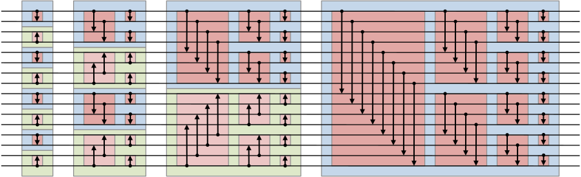

sortnet_BitonicSort
###################

This sorting network uses the *bitonic sort* algorithm.

.. rubric:: Entity Declaration:

.. literalinclude:: ../../../../src/sort/sortnet/sortnet_BitonicSort.vhdl
   :language: vhdl
   :tab-width: 2
   :linenos:
   :lines: 46-72

Source file: `sort/sortnet/sortnet_BitonicSort.vhdl <https://github.com/VLSI-EDA/PoC/blob/master/src/sort/sortnet/sortnet_BitonicSort.vhdl>`_

